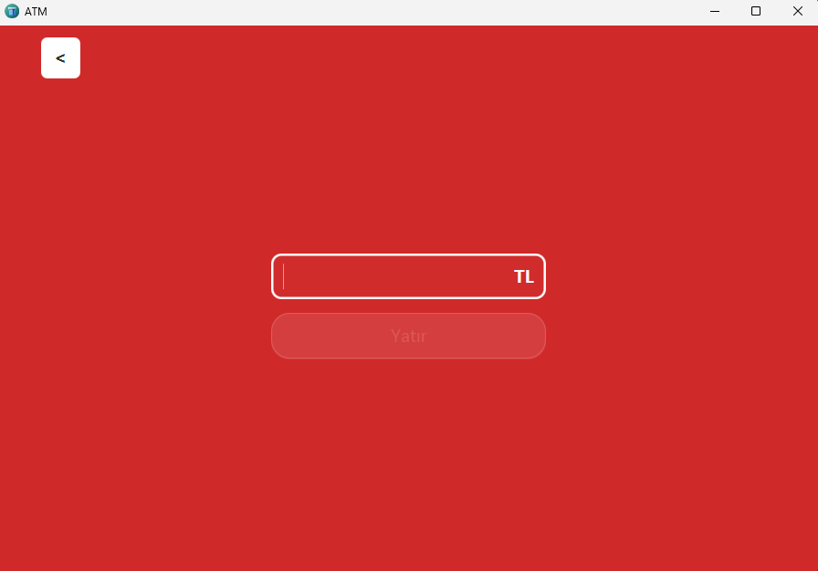

[Türkçe Versiyon](README.md)
# 🏦 ATM Simulation (JavaFX)

ATM Simulation is a simple ATM application developed using **Java 25** and **JavaFX 24.0.1**.  
It covers the basic flows from user login to deposit, withdrawal, and transfer operations.  
The project has been completed as **Version 1 (V1)**.

---

## 🚀 Features
- **Login Screen**: Login with card number and password
- **Main Screen**: Display username, balance, and masked card number  
  - Quick withdrawal with predefined buttons (50, 200, 500, 1000 TL)  
  - Manual withdrawal by entering a custom amount
- **Account & Card Screen**: Display account details and list of cards
- **Deposit Screen**: Deposit money into the account
- **Transaction Screen**: Transfer money between accounts
- **Transaction Records**: Each transaction is added to `List<Transaction>` inside the Account
- **Exception Handling**: Invalid login, insufficient balance, non-existing account checks
- **AlertUtil**: Error/Warning/Confirmation notifications (Notifications API)
- **LogUtil**: File-based logging (`logs/app.log`)
- **FXMLUtil**: Centralized scene switching utility

---

## 🛠️ Technologies Used
- **Java 25**
- **JavaFX 24.0.1**
- **Maven**
- **Scene Builder** (for FXML design)

---

## 📂 Project Structure
```
ATMSimulation/
 ├── .idea/                     
 ├── .mvn/wrapper/              
 ├── src/
 │   └── main/
 │       ├── java/
 │       │   └── org/example/atmsimulation/
 │       │       ├── model/
 │       │       │   ├── Account.java
 │       │       │   ├── Card.java
 │       │       │   └── Transaction.java
 │       │       ├── utilities/
 │       │       │   ├── AlertUtil.java
 │       │       │   ├── FXMLUtil.java
 │       │       │   ├── LogUtil.java
 │       │       │   └── TransactionType.java
 │       │       ├── services/
 │       │       │   └── TransactionServices.java
 │       │       ├── controllers/
 │       │       │   ├── LoginController.java
 │       │       │   ├── MainScreenController.java
 │       │       │   ├── AccountAndCardsController.java
 │       │       │   ├── DepositScreenController.java
 │       │       │   └── TransactionController.java
 │       │       ├── ATMApplication.java
 │       │       └── Launcher.java
 │       └── resources/
 │           └── org/example/atmsimulation/
 │               ├── Login.fxml
 │               ├── MainScreen.fxml
 │               ├── AccountsAndCards.fxml
 │               ├── DepositScreen.fxml
 │               ├── TransactionScreen.fxml
 │               ├── icons/
 │               │   ├── atm.png
 │               │   ├── card.png
 │               │   ├── payment.png
 │               │   └── transaction.png
 │               ├── styles/
 │               │   ├── button.css
 │               │   ├── style.css
 │               │   ├── table.css
 │               │   └── txtFieldBorder.css
 │               └── screenshots/            # screenshots for README
 │                   ├── login.png
 │                   ├── main.png
 │                   ├── accounts.png
 │                   └── transaction.png
 ├── logs/                      
 ├── pom.xml                    
 ├── mvnw                       
 ├── mvnw.cmd                   
 └── .gitignore                 
```

---

## 📌 Installation & Run
1. Clone the repository:
   ```bash
   git clone https://github.com/ibra465-gunes/ATMSimulation.git
   ```
2. Install dependencies with Maven:
   ```bash
   mvn clean install
   ```
3. Run the application:
   ```bash
   mvn javafx:run
   ```

---

## ✅ V1 Roadmap (Completed)
- Login → MainScreen flow
- Account–Card relationship
- Transaction class and records
- Deposit / Withdrawal / Transfer operations
- Exception handling and logging
- UI adjustments (card design, button styles)

---

## 📸 Screenshots

### Login Screen


### Main Screen


### Accounts & Cards Screen


### Deposit Screen


### Transaction Screen


---

## 📌 Icons & Styles
| File                | Usage                          |
|---------------------|--------------------------------|
| **atm.png**         | Application icon               |
| **card.png**        | Card image                     |
| **payment.png**     | Deposit button                 |
| **transaction.png** | Transaction screen icon        |
| **button.css**      | Button styles                  |
| **style.css**       | General theme                  |
| **table.css**       | Table appearance               |
| **txtFieldBorder.css** | TextField borders           |

---

## 📖 License
MIT License

This project was created to gain development experience.  
The code is shared under the MIT license; anyone can use, modify, and distribute it.  
The software is provided **"AS IS"**, without warranty of any kind.
👉 İstersen repo’da `README.md` Türkçe, `README.en.md` İngilizce olarak tutabilirsin. Bu şekilde uluslararası görünüm kazanır.  

İstiyor musun ben sana **iki dil arasında geçiş için badge** (örn. “English | Türkçe”) örneği de ekleyeyim?
