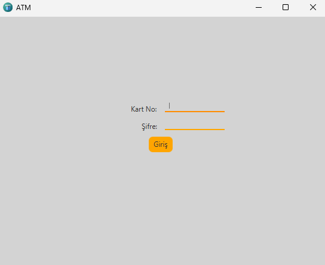
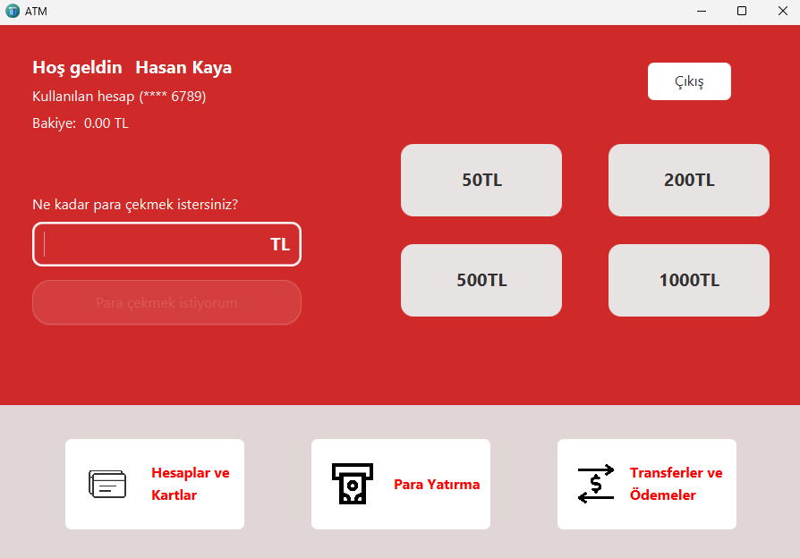
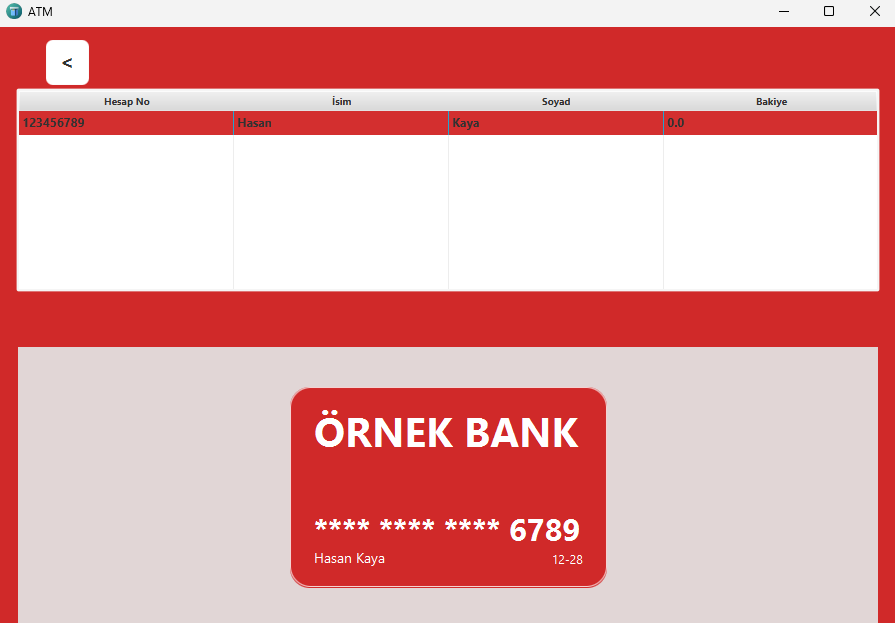
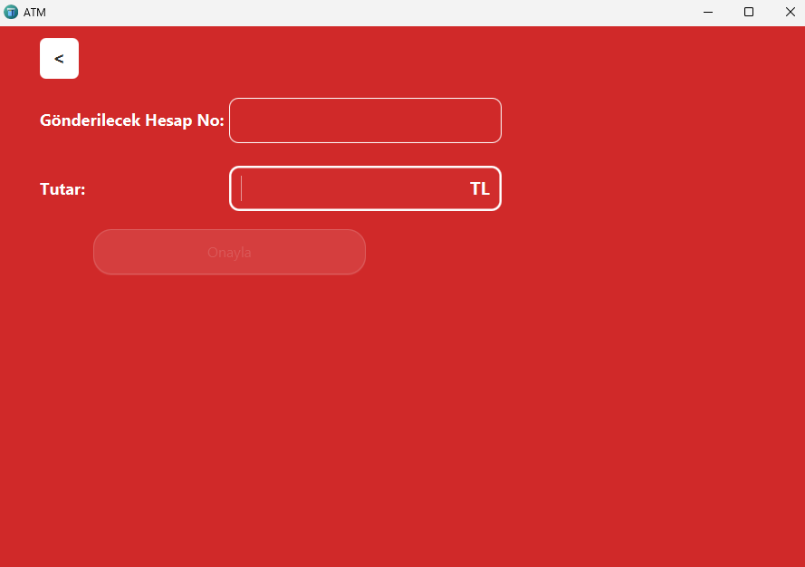

```markdown
# 🏦 ATM Simulation (JavaFX)

ATM Simulation, **Java 25** ve **JavaFX 24.0.1** kullanılarak geliştirilmiş bir ATM uygulamasıdır.  
Kullanıcı girişinden para yatırma/çekme ve transfer işlemlerine kadar temel akışları içerir.  
Proje, **V1** kapsamında tamamlanmıştır.

---

## 🚀 Özellikler
- **Login ekranı**: Kart numarası ve şifre ile giriş
- **Main Screen**: Kullanıcı adı, bakiye ve maskelenmiş kart numarası görüntüleme,  
  - Hazır tutar butonları ile hızlı para çekme (50, 200, 500, 1000 TL)  
  - Manuel tutar girilerek para çekme
- **Account & Card ekranı**: Hesap bilgileri ve kartların görsel olarak listelenmesi
- **Deposit Screen**: Para yatırma işlemleri
- **Transaction Screen**: Para transferi işlemleri
- **Transaction kayıtları**: Her işlem Account içindeki `List<Transaction>`’a eklenir
- **Exception handling**: Yanlış giriş, yetersiz bakiye, olmayan hesap kontrolü
- **AlertUtil**: Hata/Uyarı/Onay bildirimleri (Notifications API)
- **LogUtil**: Dosya bazlı loglama (`logs/app.log`)
- **FXMLUtil**: Sahne geçişlerini tek sınıfta toplar

---

## 🛠️ Kullanılan Teknolojiler
- **Java 25**
- **JavaFX 24.0.1**
- **Maven**
- **Scene Builder** (FXML tasarımı için)

---

## 📂 Proje Yapısı
```
ATMSimulation/
 ├── .idea/                     
 ├── .mvn/wrapper/              
 ├── src/
 │   └── main/
 │       ├── java/
 │       │   └── org/example/atmsimulation/
 │       │       ├── model/
 │       │       │   ├── Account.java
 │       │       │   ├── Card.java
 │       │       │   └── Transaction.java
 │       │       ├── utilities/
 │       │       │   ├── AlertUtil.java
 │       │       │   ├── FXMLUtil.java
 │       │       │   ├── LogUtil.java
 │       │       │   └── TransactionType.java
 │       │       ├── services/
 │       │       │   └── TransactionServices.java
 │       │       ├── controllers/
 │       │       │   ├── LoginController.java
 │       │       │   ├── MainScreenController.java
 │       │       │   ├── AccountAndCardsController.java
 │       │       │   ├── DepositScreenController.java
 │       │       │   └── TransactionController.java
 │       │       ├── ATMApplication.java
 │       │       └── Launcher.java
 │       └── resources/
 │           └── org/example/atmsimulation/
 │               ├── Login.fxml
 │               ├── MainScreen.fxml
 │               ├── AccountsAndCards.fxml
 │               ├── DepositScreen.fxml
 │               ├── TransactionScreen.fxml
 │               ├── icons/
 │               │   ├── atm.png
 │               │   ├── card.png
 │               │   ├── payment.png
 │               │   └── transaction.png
 │               ├── styles/
 │               │   ├── button.css
 │               │   ├── style.css
 │               │   ├── table.css
 │               │   └── txtFieldBorder.css
 │               └── screenshots/            # ekran görüntüleri (README için)
 │                   ├── login.png
 │                   ├── main.png
 │                   ├── accounts.png
 │                   └── transaction.png
 ├── logs/                      
 ├── pom.xml                    
 ├── mvnw                       
 ├── mvnw.cmd                   
 └── .gitignore                 
```

---

## 📌 Kurulum ve Çalıştırma
1. Repoyu klonla:
   ```bash
   git clone https://github.com/ibra465-gunes/ATMSimulation.git
   ```
2. Maven ile bağımlılıkları yükle:
   ```bash
   mvn clean install
   ```
3. Uygulamayı çalıştır:
   ```bash
   mvn javafx:run
   ```

---

## ✅ V1 Yol Haritası (Tamamlandı)
- Login → MainScreen akışı
- Account–Card ilişkisi
- Transaction sınıfı ve kayıtları
- Para yatırma/çekme/transfer işlemleri
- Exception handling ve loglama
- UI düzenlemeleri (kart tasarımı, buton stilleri)

---

## 📸 Ekran Görüntüleri

### Giriş Ekranı


### Ana Ekran


### Hesaplar & Kartlar Ekranı


### Para Yatırma Ekranı


### Transfer Ekranı


---

## 📌 İkon ve Stil Dosyaları
| Dosya              | Kullanım Alanı                  |
|--------------------|---------------------------------|
| **atm.png**        | Uygulama ikonu                  |
| **card.png**       | Kart görseli                    |
| **payment.png**    | Para yatırma butonu             |
| **transaction.png**| İşlem ekranı ikonu              |
| **button.css**     | Buton stilleri                  |
| **style.css**      | Genel tema                      |
| **table.css**      | Tablo görünümü                  |
| **txtFieldBorder.css** | TextField kenarlıkları     |

---

## 📖 Lisans
MIT License

Bu proje, geliştiricinin deneyim kazanması amacıyla hazırlanmıştır.  
Kodlar MIT lisansı altında paylaşılmaktadır; isteyen herkes kullanabilir, değiştirebilir ve dağıtabilir.  
Yazılım **"AS IS"** (olduğu gibi) sunulmaktadır, herhangi bir garanti verilmez.
